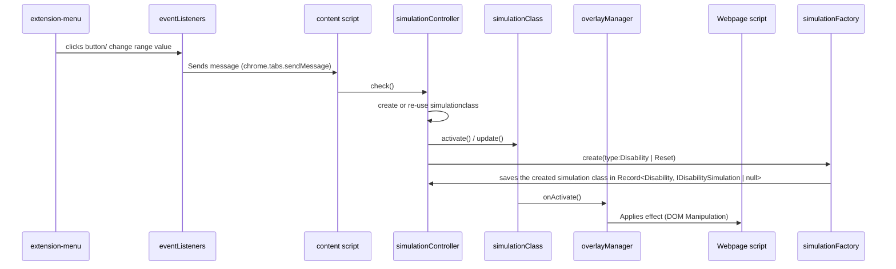

# Technical Documentation: Architecture
This document outlines the key concepts, architecture, and best practices for building a Chrome Extension using Typescript includiong how to:
    - Structure the project
    - Design Choices
    - Compile Typescript to Javascript
    - Core Components
    - Use the Chrome Extensions API's
    - Communicate between the UI and the Webpage (DOM) using the Message API.
    - In depth guide how each disability is created.
        - [Dyslexia](./Dyslexia/dyslexia.md)

# Architecture Overview
Most importing architecture principle to know when developing for this extensions is the concept of the communication between the menu, background processes and the contentscripts.

The diagram below shows how our extension works:

This is our project structure base.
* [dist](../dist)
* [docs](../doc)
* [img](../img/)
* [src](../src)
    * [controllers](../src/controllers)
        * [ExtensionMenuController](../src/controllers/ExtensionMenuController.ts)
        * [SimualtionController](../src/controllers/SimulationController.ts)
    * [DOM-Logic](../src/DOM-logic/) // Used for the dom manipulation files.
        * [OverlayManager.ts](../src/DOM-logic/OverlayManager.ts) // Used for the dom manipulation files.
    * [interfaces](./dir1/file12.ext) // Used for the dom manipulation files.
        * [IDIsabilitySimulation.ts](../src/interfaces/IDIsabilitySimulation.ts) //default simulation contract.
    * [models](../src/models) // core models, deeper level is more specifix on disability
        * [cataract](../src/models/cataract) 
            * [CataractSimulation.ts](../src/models/cataract/CataractSimulation.ts)
        * [dyslexia](../src/models/dyslexia) 
            * [DyslexiaMirrorFunctionality.ts](../src/models/dyslexia/DyslexiaMirrorFunctionality.ts)
            * [DyslexiaSimulation.ts](../src/models/dyslexia/DyslexiaSimulation.ts)
            * [DyslexiaSpacesFunctionality.ts](../src/models/dyslexia/DyslexiaSpacesFunctionality.ts)
            * [DyslexiaSwitchFunctionality.ts](../src/models/dyslexia/DyslexiaSwitchFunctionality.ts)
            * [DyslexiaWordOrderFunctionality.ts](../src/models/dyslexia/DyslexiaWordOrderFunctionality.ts)
        * [glaucoma](../src/models/glaucoma) 
            * [GlaucomaSimulation.ts](../src/models/glaucoma/GlaucomaSimulation.ts)
        * [parkinsons](../src/models/parkinsons) 
            * [ParkinsonsSimulation.ts](../src/models/parkinsons/ParkinsonsSimulation.ts)
        * [visualImpaired](../src/models/visualImpaired) 
            * [visualImpairedSimulation.ts](../src/models/visualImpaired/VisualimpairedSimulation.ts)
        * [Types.ts](../src/models/Types.ts) // default types used accros the extension
        * [SimulationFactory.ts](../src/models/SimulationFactory.ts) //the main point where the simulation classes are created.
    * [services](../src/services) 
        * [MessagingService.ts](../src/services/MessagingService.ts) //the point where the messages are send from (chrome.extension.message).    
    * [Content.ts](../src/Content.ts)// the entry point for the contentscripts, here is the listener that delegates to the simulationcontroller
    * [EventListeners.ts](../src/EventListeners.ts)// here the listeners for the menu are created, they will use the extensionMenuController to send a message to the contentscript. (Content.ts)
* [README.md](../README.md)
* [manifest.json](../manifest.json)
* [esbuild.config.js](../esbuild.config.js)
* [package.json](../package.json)

# Design choices
The code is created in Typescript, which is compiled into JavaScript before running in the browser. This approach aligns with th erequiremnts of browser extension development, as browsers natively support JavaScript but not Typescript.

## How to Compile
We have added a script in the package.json that will built the project.
Simply run: `npm run compile`, and the code will compile to the dist folder.

## Why Typescript?
    - Strong typing
    - Better maintainability
    - Easier refactoring
    - Cleaner architecture
    - Better testable
    - Knowledge in the team

## First iteration... `Why a 'Chrome' extension`
Our first idea was simple: create an iframe that we could use to edit and manipulate the content inside it.
However, we quickly ran into a problem that most of the important websites block iframe usage entirely. Since our tool is meant to show "normal" users what it's like to have a disability, it needs to work across a wide range of sites. If it doesn't work everywhere, it misses the goal of the project.
Because of this issue, we have decided to switch to building a browser extension, in our case because of the time span of 4 weeks we have chosen a Chrome extension to be exact. 
This because the extension can run on virtually any website and allows us to manipulate the DOM locally for the user. 
In a way, it works similarly to how you can edit HTML using browser dev tools—but now it's automated and accessible through our tool.

## Design pattern
At the start, we noticed that a lot of the code we were writing felt repetitive. Because of this, we looked into design patterns on the website [Refactoring Guru](https://refactoring.guru/) and saw the Factory Pattern. This pattern helped us to align our code with the SOLID principles and structure the project in a way that is more maintainable, future-proof, testable, and reusable.
We decided to implement the Factory Pattern together with a light MVC-like structure. In this setup, the controller acts mainly as a  pass-through, while t he different effects are created through factories. This allowed us to separate responsibilities and avoid duplicating logic when creating new effects.
Later in the project, we realized that the Strategy Pattern might have been a better fit for our use case or together with the factory pattern.

# Core Components Explained
There are 3 important files, concepts that combined represent the core of the extension.
The first is the menu followed by the content.ts (contentscripts in architecture overview image ) script and as last the background processes

## The menu `Extension-menu.html`
This menu runs in isolation from the website/DOM. This is ment for the user interaction (buttons, toggle, etc.) to activate the simulations.
The menu cannot manipulate or acces the DOM of the webpage, this is done through the Message API.

## Content Script `Content.ts` (DOM layer)
The content scripts refers to the `Content.ts` file, this file is the entry point of our content-related logic within the browser extension.
In the context of the browser extension a content script is a JavascriptFile that is injected into the web pages and runs in the context of the browser tab.
This allows the extension to interact with the DOM directly, wich allows us to manipulate, modify or change the webpage accordingly.

## Background processes
This is not "yet" implemented in the current extension.
But possibly it could be used for:

- Listening to browser events (e.g., tab updates, installation of the extension, or user actions like clicking the extension icon)
- Maintaining global state that needs to be shared across multiple tabs or sessions

other implementations with api's are not necessary or in the scope of this project.